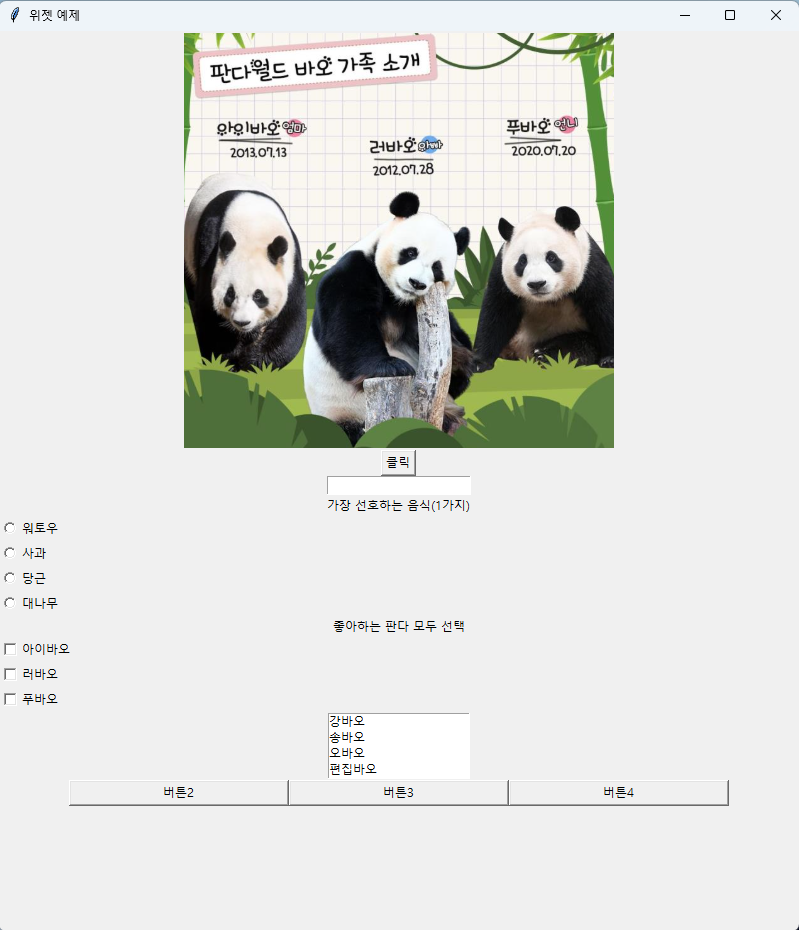

# iot_python_2025

## github 데스크톱
- **fetch origin** : 리모트 최신변경사항 확인(중요!) 
- **pull**     : 리모트에 변경사항을 로컬로 내려받기
- **commit & push** : 로컬 변경사항을 확정 및 리모트로 올리기

### 1일차 : 2월 3일
- 1교시
    - 제어판-범주 큰아이콘-사용자계정-자격 증명관리-일반 자격증명 - github계정관련 개인정보 제거
    - 파이썬 기존꺼 제거

- 2교시
    - 글꼴 추가 
        - https://notepad-plus-plus.org/downloads/v8.7.6/         
        - x64 installer
        - 구성요소-사용자정의-korean
- 3교시
    - github,github desktop 설치
- 4교시
    - local - 개인pc  ->commit push  /pull
    - remote -github
    - 파일-기본설정-설정-vscode 테마, 한글, 글자크기 등 설정  
- 오후
    - 컴파일러(exe파일 생성하는 언어) c, c++, c#, java vs 인터프리터(소스코드를 바로 실행) 파이썬, 자바스크립트
    - 파이썬    
        - 1990년에 개발한 인터프리터 언어
        - 네덜란드 개발자 귀도 반 로섬
        - 객체지향 프로그래밍 언어

    - 파이썬 개발환경 Pyenv
        - 파이썬 버전을 손쉽게 변경할 수 있는 툴
        - 설치순서 및 참고자료 : https://pyenv-win.github.io/pyenv-win/
            - powershell 관리자로 실행
            - Set-ExecutionPolicy -ExecutionPolicy RemoteSigned -Scope LocalMachine
            - y
            - Invoke-WebRequest -UseBasicParsing -Uri "https://raw.githubusercontent.com/pyenv-win/pyenv-win/master/pyenv-win/install-pyenv-win.ps1" -OutFile "./install-pyenv-win.ps1"; &"./install-pyenv-win.ps1"
            - powershell 종료 후 , 재접속해서 pyenv --version해서 pyenv 3.1.1 확인
            - pyenv install --list : pyenv로 설치할 수 있는 파이썬 버전들이 나열됨
            - pyenv install 3.11.9
            - pyenv install 3.9.13
            - pyenv versions :설치된 파이썬 버전 확인
            - pyenv global 3.11.9 : 파이썬 버전 중 사용하고자 하는 버전 선택
            - exit() : 파이썬 빠져나오기

    - visual studio code
        - 확장에서 python 설치
        
### 2일차 : 2월 4일
- 파이썬 기초
    - **주석 처리 : ctrl + /**
    - **한줄 삭제: shift + del**
    - **markdown 미리보기 : ctrl + shift + v**
    - **줄 위치 이동 : alt + 화살표**
    - 변수와 자료형
        - 변수명 규칙
        - 자료형 : none, int, float, str, bool, list, tuple(수정불가), dic, set(중복제거& 순서가 정해져 있지 않다.인덱스가 없다.)
    - 입출력
        - 화면입출력
            - `입력 , 출력 값은 모두 문자열이다.`
            - number = int(input('숫자를 입력하세요: '))   print(type(number)) 
        - 문자열포맷팅
            - %s , %d, %f 
            - '{0} {1}'.format()
            - f'{name} {age}'
    - 연산자
        - 사칙연산 : + ,-,*, //, /, %, **, ()
        - 연산자 우선순위
        - 리스트연산 : 인덱싱, 슬라이싱(`[start :end]  end-1 까지 출력`), 수정
        - 문자열연산 : + , * , 인덱싱, 슬라이싱, split, replace, rstrip, upper, find 
### 3일차 : 2월 5일
- print(값, sep=" " ,  end = "\n") 
    - print("가","나") : 가 나로 출력되는 이유는 sep = " " 때문이다.    
    - print(f'{i} x {j} = {i * j:>2} ', end=' ') 
    - {i * j:>2} {i * j:2d} 
- 흐름제어
    1) 조건문
        1) if 조건1 : 
              실행문1 
           elif 조건2 :
              실행문2
           else : 
    
    2) 반복문
    - `break(반복문 종료), continue(지나침)`
    -  `for문은 자동증가한 반면, while문은 i+=1과 같이 증가시켜줘야 함`
        1) for i in range():
        2)  while 조건: 

    - 조건에 변수가 들어갈 경우, 미리 선언해줘햐 함
    - 합을 구하는 반목문의 경우,  sum=0 미리 선언해줘햐 함
    - 반복문으로 합을 구하고 또 다른 반복문으로 합을 구할 경우, sum=0으로 할지, sum을 이어할지 선택해야 함        
       
- 파일입출력
    - mode : r, w(쓰기), a(추가)
        - 쓰기의 경우, \n이 기본적으로 없기에 연결해서 써짐 
        - 쓰기의 경우, 기존있던 txt에 다시 쓰기할 경우, 기존 내용 대신 새 내용으로 덮여써짐
        - 추가의 경우, 기존있던 내용에 더해짐
    - encoding : 한글만(euc-kr, cp949) , 국제어(utf-8)
    - 파일경로 
        - 절대 C:/Source/iot_python_2025       
        - 상대 .(현재위치)  ..(부모위치)
        - 윈도우 역슬래쉬  C:\\Source\\iot_python_2025 (* 파이썬에서는 \n과 같은 예약어이기에 )
    - open(경로, mode, encoding) ,close() 
    - write() , readline()

- 함수 (매개변수 유무, return값)
    - 함수의 return값이 있을 때, print()함수내에 함수호출
    ``` python 
    def 함수명 (매개변수) :
            로직
    ```

- 객체지향
    - 객체의 틀이 되는 클래스 선언
    - 클래스 : 명사와 동사의 집합
        - 명사 : 멤버변수(속성)
        - 동사 : 멤버함수(메서드)
    ``` python
    class 클래스명 :
        #멤버변수

        def 멤버함수 (self, 매개변수):
            #로직
    ```
### 4일차 : 2월 6일   
- 리스트 연산
    - for, while문에는 반복할 수 있는 요소가 필요(iterable)  (예)range(5) [1,2,3]
    - 자료구조에서는 딕셔너리(키, 값 저장 역할), 리스트(반복문에서 활용)를 주로 사용한다.

    - 연산 : + , * , del(lst),del(lst[0]),  lst.append(), lst.insert(index, value) , len(), sort(reverse=false) , reverse(인덱스를 뒤에꺼부터 시작하는, 값 반전) , index(value) , pop()하면 return은 value이다.
    - `리스트 컴프리핸션  arr = [i for i in range(1,101)]`
- 리스트와 문자열 연산 정리
    - 공통: 인덱싱, 슬라이싱 , + , *   
        - 리스트 :  `데이터수정가능`, append,del,insert,len, sort , pop, index 등                                    
        - 문자열 : replace,upper,lower, strip, find, count , split


- 객체지향
    - object는 모든 클래스의 부모 클래스이다.
    - 클래스 작성방법, 속성, 메서드, 캡슐화(멤버변수 폐쇄화, __멤버변수), **상속** , **추상화**, **인터페이스**, **다형성** ,**SOLID원칙**

    1. 멤버변수
        - ` 멤버변수 이름 앞에 __ 쓰면 외부접근 불가`
    2. 멤버함수
        - get, set 사용자 지정 함수 + 조건문 추가 (예)if type(plateNumber) is str:
        - __str__을 통해 객체의 멤버변수 내용 출력

- 모듈, 패키지 
    1. 모듈 : 함수나 클래스 등 자주 사용할 파이썬 파일로 만든것
        - import 모듈명 , from 모듈명 import 상세

    2. 패키지(라이브러리) : 모듈을 모아둔 폴더
        - `설치가이드 사이트: https://pypi.org/`
        - pip install

    - `if __name__ == '__main__' `
        - __main__ 은 프로그램이 시작하는 진입점(entry point) 지칭
        - c언어 등의 static void main()과 동일한 역할
        - `폴더 안에 py파일 중 실행되는 파이썬 파일이 __main__이 되고 나머지는 모듈이 됨`

### 5일차 : 2월 7일   
- 백준문제 문자열 연산
    - list_a =input().split() 일 때, type(list_a)는 list이다. 
    - list(map(int, input().split()))
    - [0]*10

- 리스트 연산 추가(append, extend)
    ``` python
        x= ['W' ,'Y' , 'Z']
        y= ['A' ,'C' , 'E']
        x.append(y)
        print(x)    #['W', 'Y', 'Z', ['A', 'C', 'E']]

        x= ['W' ,'Y' , 'Z']
        y= ['A' ,'C' , 'E']
        x.extend(y)
        print(x)    #['W', 'Y', 'Z', 'A', 'C', 'E']
    ```
- 스폐셜함수 조회 : print(dir(int))   

- `보기 - 자동줄바꿈 체크`
- `VERSION = 0.1   # 변수를 상수화 : 대문자`
- `for i, v in enumerate(items):`

``` python
# items변수는 list타입이라고 지정
def get_movie(items:list):
    for item in items :
        print(item) 
 ```
- 예외처리
    1) 문법적 오류 - error 
        - 코드 작성 시 빨간 밑줄 뜸, 콘솔창에 오류 뜨지 않음
        - 오류표시가 안 나는 코딩을 잘못한 오류 포함 (예)mul(7,6) -> 42 예상 , 그러나 결과가 13인 경우 
    
    2)  예외  - exception 
        - 실행 중 발생하여 프로그램을 비정상 종료시키는 것
        - 콘솔창에 오류 뜸
        - 예외처리 안에 또 예외처리 넣으면 속도 느려짐이 심해지니 지양
        
    ``` python
        try :
        except Exception as e:
        finally :
    ```
       

- 디버깅 : 왼쪽의 실행 및 디버그 탭
    -   시작 f5
    -   중단점 f9
    -   한줄실행 -f10
    -   함수 내부로 들어가면서 한줄 실행 f11
    -   종료 shift f5
    -   변수탭
    -   조사식탭

### 5일차 : 2월 7일   토이프로젝트 (콘솔앱 : 내 영화 앱)
- 예외처리
    -  메뉴 입력 sel_menu = int(input('메뉴 번호입력:'))
        - ㅂ일 경우, ValueError => try: except :sel_menu = 0 로 예외처리

    - 영화정보 입력  title, release, sponsor, rate = input('영화입력[영화제목|개봉일| 배급사|평점 순]: ').split('|')
        - input은 문자열이기에 개봉일, 평점을 int, float으로 행변환해야 나중에 연산할 수 있다.
        - 입력한 개수가 4개가 아닐경우, try except로 예외처리
        - 입력 순서가 title, release, sponsor, rate순서여야 정해둔 행변환 실행오류 없다.

- 보통 삭제할 때, id를 삭제한다. 지금은 id없으니 이름으로 삭제한다.

- 파일쓰기, 읽기
    - f.write(f'{}')
    - f.readline().replace().split()
    - `파일에서 읽을 때 숫자나 실수는 문자열이기에 int(), float()해줘야함`

### 6일차 : 2월 10일 
- 화면녹화 캡처 프로그램 : 픽픽
    - shift + printScreen
    - 저장경로 설정


- 파이썬 응용 1
    - 토이프로젝트
        - 내 영화 앱 수정, 마무리
            - 예외처리
            - 화면편집

https://github.com/user-attachments/assets/56133dcc-3b15-40b8-b252-f903ec6ccb03

 - 파이썬 응용 2  
    - 주피터 노트북 : GUI 학습에는 불합리/빅데이터분석, 머신러닝, 딥러닝에 많이 활용
        - 파이썬으로 연구를 목적으로 하는 리포트 작성에 특화된 기술
        - 설치
            - CTRL + SHIFT + P (명령 팔레트) 
            - CREATE :새 Jupyter Notebook
            - `파일 저장 먼저 해야함!!!`
        - 커널 설치
            - 커널 선택 - 확장추천 - 현재 쓰고 있는 파이썬 버전 선택- vscode 허용
                
        - 기본사용법
            - `파일 저장 먼저 해야함!!!`
            - CTRL + ENTER : 실행
            - ENTER : 작성    
            - ALT + ENTER : 실행 및 쉘 추가
            - B
            - `터미널 명령어 실행 : 코드쉘에서 !를 붙이고 명령어 실행`


    - GUI 학습-tinker
        - GUI (Graphic User Interface) - 그래픽 사용자 인터페이스
        - CLI (Console Line Interface) - GUI 이전에 사용자 인터페이스.사용이 불편. 사용자가 명령어를 거의 다 외워서 사용


        ```python
        from tkinter import *
        import tkinter.font as fnt
        from tkinter.messagebox import *

        root = Tk()
        # 위젯, 이벤트
        
        # Label(image=), Button(command=), Entry(),  Radiobutton(value, variable) ,
        # Checkbutton( variable) , ListBox(height=), Frame()
        # 위젯.pack()

        # def countUp(): showInfo()
        
        root.mainloop()
        ```
        - 주피터노트북에서 만든 카운터 실습 예제 코드를 라이브러리 포함해서 .py파일에서 실행할 수 있다.
        - `.ipynb 파일경로 :img = PhotoImage(file='./baoFamily.png')`
        - `.py 파일경로 :img = PhotoImage(file='./day06/baoFamily.png')`
 
<!-- 주석 -->
<!-- html에서 사용하는  태그로 캡처한 이미지를 추가-->

<!--  -->


- 파이썬 응용 2              
    - 파이썬 GUI 라이브러리
        1. PyQt / PySide
            - 파이썬 최고의 GUI 라이브러리.
            - Qt라는 C/C++ 사용할 GUI 라이브러리를 Python용으로 변경
            - 화려한 UI 구성
            - 코딩 다양성
            - 조금 어렵다(Python코드와 분리가능)
            - Qt가 라이선스 구매필수, 반면 프리웨어로 변경한게 Pyside

        2. Tkinter 
            - 파이썬에 내장되어 있는 GUI 라이브러리
            - 아주 단순. 학습이 쉬움
            - 안 이쁘다

        3. Kivy
            - 가장 최근에 나온 GUI 라이브러리
            - 안드로이드, IOS 모바일 앱 UI로 사용가능
            - 모바일 특화로 멀티플랫폼 지원
            - 가장 어렵다
        
    - API
        - 구글 gemini api

### 7일차 : 2월 11일     
- 파이썬 응용 3
    - 챗gpt 유사앱 -구글 제미나이 api +tkinter ->chapbot만들기과정.txt 참고하기
    - `gemini챗앱을 클래스로 만들기 -> py02_gemini_app.py`

- 실행파일 만들기
    - pyinstaller 모듈 설치 
        - pip install pyinstaller
    - 실행파일 명령어 (터미널에서 실행)
        - pyinstaller --onefile python_file.py  (예)pyinstaller --onefile .\day07\py02_gemini_app.py
        - 같이 실행되는 터미널을 제거하려면  pyinstaller --onefile .\day07\py02_gemini_app.py --noconsole
        - 아이콘 등의 리소스를 dist폴더에 복사필요
        - 실행파일 경로 :C:\Source\iot_python_2025\dist
    
https://github.com/user-attachments/assets/5eaff7bf-9cf6-4e32-907e-bb21fc3c02b1


### 8일차 : 2월 12일  
- 파이썬 응용 4
    - GUI 중 Pygame
        - 기본 윈도우 학습
        

        - 이벤트 처리

        https://github.com/user-attachments/assets/53e2e056-3ab9-4c0f-aeb2-ac86cc4e74f5
      
        https://github.com/user-attachments/assets/9e7fa95f-5a4e-4304-9f65-a07353c0880d

        - 간단한 게임
        -  이미지, 사운드 등 리소스 활용 게임
